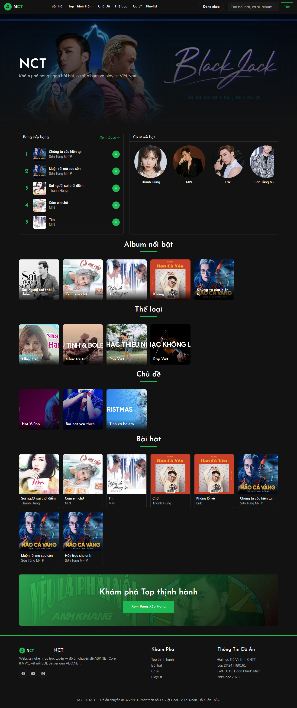

# Website Nghe Nhạc Trực Tuyến

## Đề tài: Xây dựng Website nghe nhạc trực tuyến (ASP.NET)

Đồ án chuyên đề ASP.NET xây dựng website nghe nhạc trực tuyến với đầy đủ chức năng dành cho người dùng và quản trị viên, được phát triển bằng **C# / ASP.NET Core 8 MVC** kết nối **Microsoft SQL Server** qua **ADO.NET**.

---

# Thông tin đồ án

| Thông tin                | Chi tiết                                                                   |
| ------------------------ | -------------------------------------------------------------------------- |
| **Trường**               | Đại học Trà Vinh – Trường Kỹ thuật và Công nghệ – Khoa Công nghệ Thông tin |
| **Lớp**                  | DK24TT80161                                                                |
| **Giảng viên hướng dẫn** | TS. Đoàn Phước Miền                                                        |
| **Năm học**              | 2026                                                                       |

### Nhóm sinh viên thực hiện

| STT | Họ và tên    | MSSV      |
| --: | ------------ | --------- |
|   1 | Lê Việt Hoài | 170124610 |
|   2 | Lê Thị Nhàn  | 170124608 |
|   3 | Đỗ Xuân Thủy | 170124411 |

---

# 1. Giới thiệu

Website nghe nhạc trực tuyến cho phép người dùng nghe nhạc, tìm kiếm bài hát, xem thông tin ca sĩ, album, chủ đề, thể loại và thưởng thức âm nhạc theo playlist. Bên cạnh đó, hệ thống còn cung cấp trang quản trị (Admin) giúp quản lý toàn bộ dữ liệu của website.

### Công nghệ sử dụng

* **Ngôn ngữ lập trình:** C#
* **Nền tảng:** ASP.NET Core 8 MVC
* **Cơ sở dữ liệu:** Microsoft SQL Server
* **Truy xuất dữ liệu:** ADO.NET (`Microsoft.Data.SqlClient`)
* **Giao diện:** HTML5, CSS3, JavaScript + **Bootstrap 5.3.3** + **jQuery 3.7.1**
* **Xác thực:** Custom cookie authentication
* **Quy trình phát triển:** Waterfall
* **Công cụ phát triển:** Visual Studio, SQL Server Management Studio (SSMS), Git, GitHub

---

## Giao diện trang chủ



---

# 2. Chức năng chính

## Người dùng (Frontend)

* Xem trang chủ với slideshow (Bootstrap Carousel) và 4 danh sách: thể loại, chủ đề, album, bài hát.
* **Player bar cố định** phát liên tục qua các trang (lưu trạng thái `localStorage`, có nút đóng).
* Nghe nhạc trực tuyến bằng `<audio>` native, xem lời bài hát.
* **Top thịnh hành** — trang `/BaiHat/Top` xếp hạng theo lượt nghe.
* **Bài hát liên quan** — gợi ý cuối trang chi tiết theo cùng thể loại.
* Xem danh sách và trang chi tiết của:
  * Bài hát (kèm lượt nghe)
  * Ca sĩ (gộp bài hát + album của ca sĩ qua join)
  * Album
  * Chủ đề
  * Thể loại
  * Playlist
* Lọc danh sách theo thể loại.
* Nghe nhạc theo Playlist.
* Tìm kiếm theo 1 từ khóa (`q`), tìm trên 6 thực thể, chỉ hiển thị mục có kết quả.
* Đăng nhập / Đăng ký tài khoản (cookie auth, validate phía server).
* **Yêu thích bài hát** (❤️) + trang **"Nhạc của tôi"** (`/YeuThich/MyMusic`) cho thành viên đăng nhập.

## Quản trị viên (Admin, area `/Admin`)

* Toàn bộ area đặt `[Authorize(Roles = "Admin")]` — chỉ vai trò Admin được vào, người thường về trang đăng nhập / AccessDenied.
* **Phân quyền theo vai trò** (`vaitro`: Admin / User), đăng nhập gắn `ClaimTypes.Role`.
* **Dashboard quản trị** (`/Admin`) — thẻ thống kê + biểu đồ Chart.js (Top 5 lượt nghe).
* Đăng nhập và đăng ký tài khoản quản trị.
* Quản lý (Thêm / Sửa / Xóa) đầy đủ cho **10 thực thể**:
  * Bài hát, Ca sĩ, Album, Thể loại, Chủ đề, Playlist
  * 3 bảng trung gian (nhiều-nhiều): Ca sĩ – Bài hát, Ca sĩ – Album, Playlist – Bài hát
  * Tài khoản (chọn vai trò khi tạo/sửa)
* Tải lên hình ảnh qua `IFormFile` vào `wwwroot/images/<entity>/`.
* Antiforgery token trên mọi form POST, hộp thoại xác nhận khi xóa.

---

# 3. Kiến trúc

```
Controller (routing/HTTP) → Service (business logic) → ADO.NET (SqlDataReader) → SQL Server
```

Mỗi service là một lớp injected qua DI, dùng `SqlConnection` + `SqlCommand` parameter hóa. Connection string duy nhất đọc từ `appsettings.json`, mỗi method mở connection trong `using` (không leak).

### Stack

| Thành phần        | Công nghệ                                  |
| ----------------- | ------------------------------------------ |
| Framework         | ASP.NET Core 8 MVC                         |
| Data access       | ADO.NET (`Microsoft.Data.SqlClient`)       |
| DB                | SQL Server                                 |
| Auth              | Custom cookie authentication               |
| Views             | Razor + Tag Helpers                        |
| CSS/JS            | Bootstrap 5.3.3 + jQuery 3.7.1 (CDN)       |
| UI/UX             | Dark theme (FE, `data-bs-theme=dark`) + light (Admin) |

---

# 4. Cấu trúc thư mục

```text
webmusicASP/
├── progress-report/      # Báo cáo tiến độ
│   ├── BaoCaoTuan1.txt
│   ├── BaoCaoTuan2.txt
│   ├── BaoCaoTuan3.txt
│   ├── BaoCaoTuan4.txt
│   ├── BaoCaoTuan5.txt
│   └── BaoCaoTuan6.txt
│
├── setup/
│   └── nhaccuatui.sql     # Script tạo cơ sở dữ liệu (bản ASP.NET Core 8)
│
├── src/
│   └── WebMusic/         # Mã nguồn ASP.NET Core 8 MVC
│       ├── Areas/Admin/  # Khu quản trị (11 controller + views CRUD, [Authorize(Roles=Admin)])
│       ├── Controllers/  # Khu người dùng (10 controller)
│       ├── Data/         # Db.cs (connection helper)
│       ├── Models/       # 11 entity (POCO)
│       ├── Services/     # 9 service + interface (ADO.NET)
│       ├── ViewModels/   # DTO cho view phức tạp
│       ├── Views/        # Razor views (FE) + _Layout (Bootstrap dark)
│       ├── wwwroot/
│       │   ├── js/player.js  # player bar localStorage
│       │   ├── images/
│       │   └── audio/
│       ├── Program.cs
│       └── appsettings.json
│
└── thesis/
    └── ASPNET-DK24TT80161-LeVietHoai-WebMusic.pdf
```

---

# 5. Hướng dẫn cài đặt

## Yêu cầu

* [.NET 8 SDK](https://dotnet.microsoft.com/download/dotnet/8.0)
* Visual Studio 2022 hoặc VS Code
* Microsoft SQL Server (LocalDB hoặc instance bất kỳ)
* SQL Server Management Studio (SSMS)

## Các bước cài đặt

### Bước 1. Tải mã nguồn

```bash
git clone <repository-url>
cd webmusicASP
```

### Bước 2. Tạo cơ sở dữ liệu

Chạy script tạo database + seed dữ liệu mẫu:

```bash
sqlcmd -S . -i setup/nhaccuatui.sql
```

Script `nhaccuatui.sql` tự động:

* Drop + tạo lại DB `Nhaccuatui`.
* Tạo 12 bảng + khóa ngoại (bảng trung gian + `yeuthich` có `ON DELETE CASCADE`).
* Bảng `baihat` có cột `luotnghe`; `taikhoan` có cột `vaitro` (Admin/User).
* Seed dữ liệu mẫu (bài hát, ca sĩ, album, chủ đề, thể loại, playlist, các bảng trung gian, 2 tài khoản: admin/123 vai trò Admin, huyen/123456 vai trò User).

### Bước 3. Cấu hình chuỗi kết nối

Sửa `src/WebMusic/appsettings.json` cho đúng SQL Server của bạn:

```json
"ConnectionStrings": {
  "MusicDb": "Server=.;Database=Nhaccuatui;Trusted_Connection=True;TrustServerCertificate=True;"
}
```

### Bước 4. Chạy chương trình

```bash
cd src/WebMusic
dotnet restore
dotnet build
dotnet run
```

Mở http://localhost:5258

---

# 6. Tài khoản thử nghiệm

| Vai trò       | Tài khoản | Mật khẩu  |
| ------------- | --------- | --------- |
| Quản trị viên | `admin`   | `123`     |
| Người dùng    | `huyen`   | `123456`  |

Tài khoản trên đã được tạo sẵn trong `setup/nhaccuatui.sql`. Có thể tạo thêm tài khoản mới thông qua chức năng **Đăng ký**.

---

# 7. Báo cáo tiến độ

Các báo cáo tiến độ được lưu trong thư mục:

```text
progress-report/
```

| Tuần    | Thời gian               | Nội dung                                                |
| ------- | ----------------------- | ------------------------------------------------------- |
| Tuần 1  | 01/06/2026 – 07/06/2026 | Khảo sát và phân tích yêu cầu                           |
| Tuần 2  | 08/06/2026 – 14/06/2026 | Thiết kế cơ sở dữ liệu và ERD                           |
| Tuần 3  | 15/06/2026 – 21/06/2026 | Xây dựng Models và Controllers                          |
| Tuần 4  | 22/06/2026 – 28/06/2026 | Xây dựng chức năng quản trị (Back-end)                  |
| Tuần 5  | 29/06/2026 – 05/07/2026 | Xây dựng giao diện người dùng và chức năng phát nhạc    |
| Tuần 6  | 06/07/2026 – 12/07/2026 | Tìm kiếm, kiểm thử, hoàn thiện hệ thống và viết báo cáo |
| Tuần 7  | 12/08/2026 – 18/08/2026 | Tinh chỉnh chức năng, migration UI sang Bootstrap + jQuery, viết lại báo cáo |
| Tuần 8  | 19/08/2026 – 25/08/2026 | Hoàn thiện, kiểm thử và bàn giao đồ án                  |

---

# 8. Kết quả đạt được

Sau quá trình thực hiện, nhóm đã hoàn thành các nội dung sau:

* Thiết kế và xây dựng cơ sở dữ liệu trên Microsoft SQL Server.
* Xây dựng đầy đủ chức năng quản trị (CRUD) cho 10 thực thể.
* Hoàn thiện giao diện người dùng (Bootstrap dark theme, responsive) và khu quản trị (Bootstrap light theme).
* Tích hợp chức năng phát nhạc trực tuyến bằng HTML5 Audio.
* Hỗ trợ tìm kiếm trên 6 thực thể với 1 từ khóa.
* Xác thực cookie.
* Hoàn thiện báo cáo đồ án và tài liệu hướng dẫn cài đặt.

---

# 9. Hướng phát triển

Trong tương lai, hệ thống có thể được mở rộng với các chức năng:

* Đăng nhập bằng Google hoặc Facebook.
* Yêu thích bài hát.
* Bình luận và đánh giá.
* Bảng xếp hạng bài hát.
* Gợi ý nhạc theo sở thích.
* Chia sẻ Playlist.
* Phát nhạc nền liên tục.

---

**Đồ án Chuyên đề ASP.NET – Website Nghe Nhạc Trực Tuyến**
**Lớp:** DK24TT80161
**Giảng viên hướng dẫn:** TS. Đoàn Phước Miền
**Năm học:** 2026